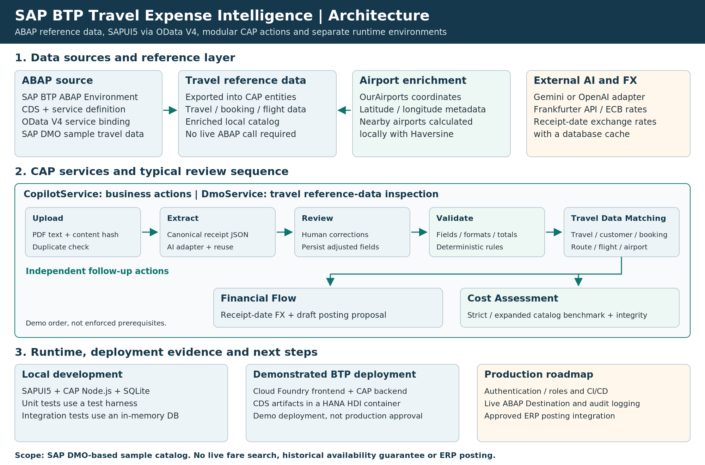
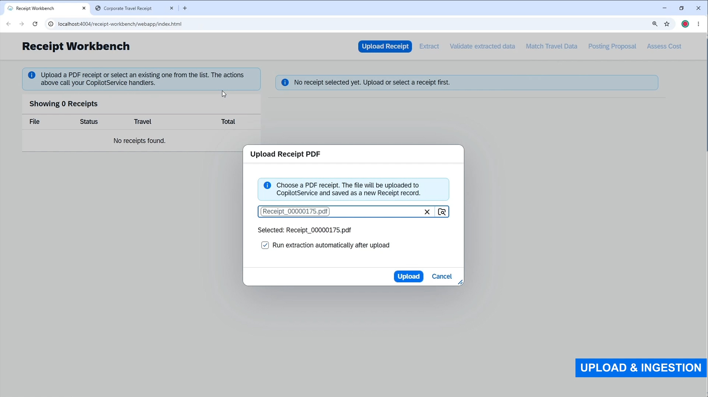
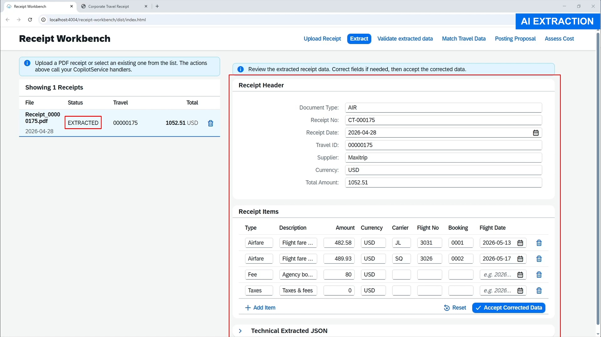
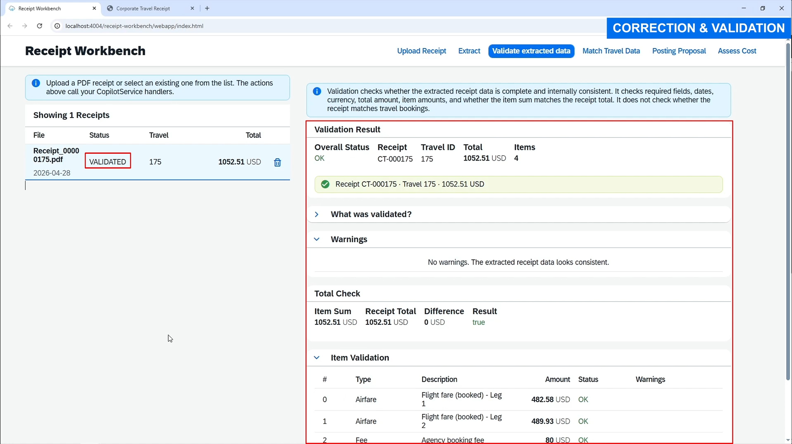
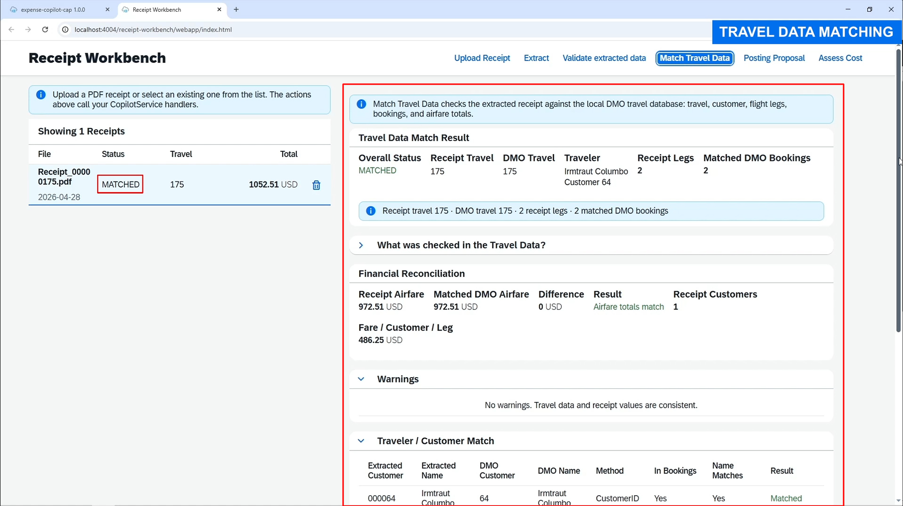
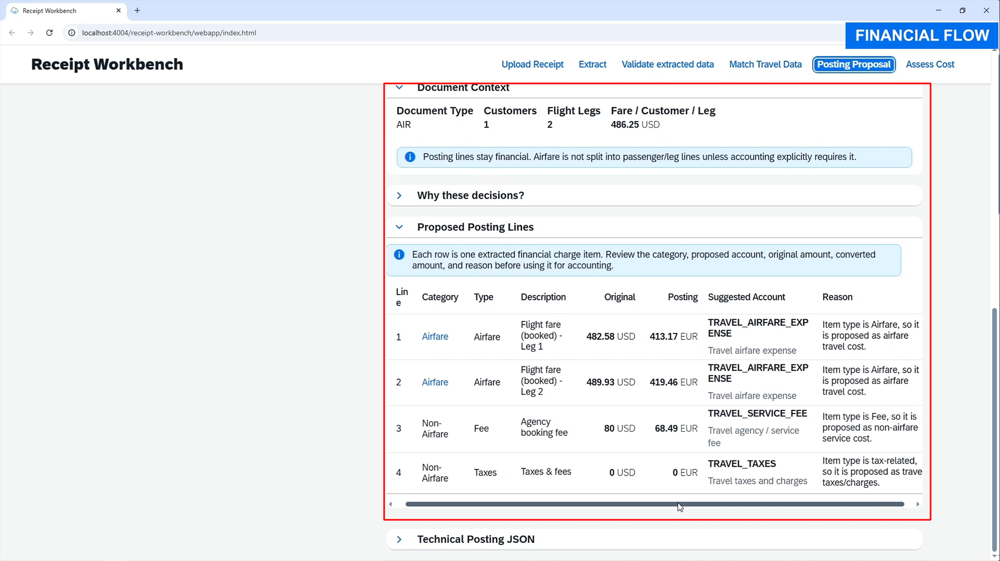
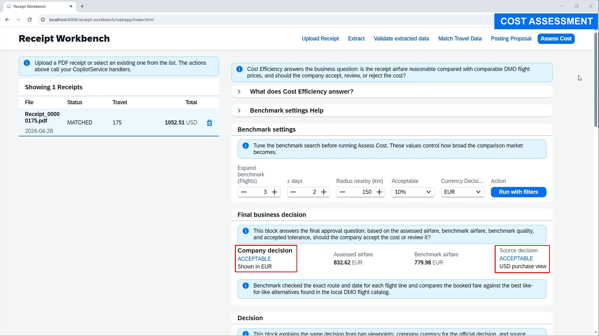
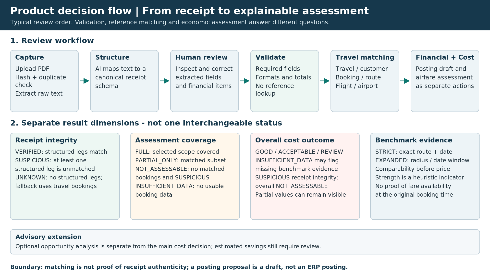

# SAP BTP Travel Expense Intelligence

> Explainable receipt validation and airfare cost assessment on SAP BTP using CAP, SAPUI5, OData V4 and SAP HANA Cloud.

[SAP BTP Travel Expense Intelligence – Technical Workflow](https://www.youtube.com/watch?v=rPoYeKcS0Ic) · [Project Overview](https://www.youtube.com/watch?v=Hjye6RPOxQo)

**Related SAP ABAP / OData project:** [expense-copilot-abap](https://github.com/PyCreatorr/expense-copilot-abap)

## Why this project exists

Travel receipts are often reviewed across several disconnected steps: PDF reading, manual data entry, travel-record reconciliation, currency conversion and cost plausibility checks. This project brings those steps into one review workbench and makes the evidence behind each result visible.

The application deliberately separates probabilistic AI extraction from deterministic business logic:

- an LLM structures receipt text;
- users can review and correct the extracted values;
- CAP services validate required fields, formats, totals and internal consistency;
- Travel Data Matching reconciles the receipt with SAP travel and booking reference data;
- FX, posting-proposal and cost-assessment logic produce reviewable decision support.

## Key capabilities

- **PDF intake and deduplication:** Base64 upload, `pdf-parse`, SHA-256 content hash and extraction reuse.
- **Provider-independent AI extraction:** configurable Gemini/OpenAI adapter and a stable receipt data contract.
- **Human-in-the-loop correction:** extracted receipt data can be reviewed, edited and persisted from the UI.
- **Deterministic validation:** required fields, dates, currency, item totals and header totals are checked independently from the LLM.
- **Travel Data Matching:** travel, customer, booking, connection, flight and airport data are matched and enriched against the SAP DMO-based travel reference layer.
- **Receipt-date FX conversion:** Frankfurter API / ECB reference-rate data with local caching.
- **Posting proposal:** separates airfare and non-airfare items and prepares a transparent accounting draft; it does not execute an ERP posting.
- **Explainable airfare assessment:** strict and expanded benchmarks, receipt-integrity checks, explicit benchmark strength and outcomes such as `GOOD`, `ACCEPTABLE`, `REVIEW`, `INSUFFICIENT_DATA` and `NOT_ASSESSABLE`.
- **Opportunity exploration:** supports controlled nearby-airport and date-window comparisons using configurable benchmark settings.

## End-to-end flow

1. Upload a travel receipt PDF.
2. Extract raw text with `pdf-parse`.
3. Map the text to a canonical receipt schema through Gemini or OpenAI.
4. Review and correct the extracted business fields.
5. Validate completeness and internal financial consistency.
6. Match the receipt with SAP travel and booking reference data.
7. Convert values into a selected decision/posting currency when required.
8. Create a transparent draft posting proposal.
9. Assess airfare reasonableness against comparable travel alternatives.
10. Review the evidence and final result in the SAPUI5 workbench.

## Architecture



### Data origin

The source scenario was prepared in SAP BTP ABAP Environment using ABAP CDS projections, a service definition and an OData V4 service binding. The exposed SAP DMO sample dataset is used as the travel reference layer for the application and includes:

- Airports
- Agencies
- Customers
- Connections
- Flights
- Bookings
- Travels

Because a trial landscape is not a stable public data source, the relevant reference data was exported into a reproducible CAP data layer for development and testing. Locally, the application runs with SQLite. Airport records were additionally enriched with geographic coordinates and metadata from the open OurAirports dataset so that nearby-airport scenarios can be tested realistically.

The related ABAP/OData source project is available separately at [expense-copilot-abap](https://github.com/PyCreatorr/expense-copilot-abap).

For deployment, the application has been demonstrated on SAP BTP Cloud Foundry with application/service modules and an SAP HANA Cloud / HDI persistence layer. The public repository should still be treated as a portfolio implementation rather than a production-ready deployment template until all security, destination and deployment artifacts are fully reproducible from a clean environment.

## Technical stack

| Layer                  | Technology                                                                             |
| ---------------------- | -------------------------------------------------------------------------------------- |
| Backend                | SAP CAP for Node.js, JavaScript, CDS, OData V4 actions                                 |
| Frontend               | Freestyle SAPUI5, XML views/fragments, OData V4 model, JSONModel                       |
| Persistence            | SQLite for local development; SAP HANA Cloud / HDI for the demonstrated BTP deployment |
| SAP integration        | SAP BTP ABAP Environment, RAP/OData V4 source, Destination-oriented integration path   |
| AI                     | Google Gemini or OpenAI through a configurable adapter                                 |
| External data/services | OurAirports, Frankfurter API / ECB reference-rate data                                 |
| Deployment             | SAP BTP Cloud Foundry, MTA-oriented deployment structure, HANA HDI                     |

## Repository structure

```text
app/
  receipt-workbench/       # SAPUI5 application

db/
  schema.cds               # receipt and travel-reference data model

srv/
  copilot-service.cds      # OData V4 service contract
  copilot-service.js       # service registration and upload logic
  handlers/                # extraction, matching, validation, posting, assessment
  adapters/                # AI, FX, airport and supporting adapters

test/                      # unit and integration tests

scripts/
  import-dmo-snapshot.js   # normalize permitted DMO/OData exports into CAP seed data
  enrich-airports.js       # enrich airport data from OurAirports

docs/
  architecture_overview.png
  product_decision_flow.png
  demo.md
  screenshots/

migration/                 # optional migration / data-preparation helpers
mta.yaml                   # BTP deployment descriptor, where included in the public package
package.json
README.md
```

## Main service actions

| Action                      | Purpose                                                                              |
| --------------------------- | ------------------------------------------------------------------------------------ |
| `uploadReceipt`             | Stores PDF text and content hash                                                     |
| `extract`                   | Creates structured receipt JSON through the selected LLM                             |
| `updateExtractedReceipt`    | Persists human corrections                                                           |
| `validate`                  | Checks completeness, formats and internal consistency                                |
| `matchDMO`                  | Technical action name for Travel Data Matching against the DMO-based reference layer |
| `convertFx`                 | Converts receipt totals using receipt-date FX                                        |
| `postingProposal`           | Builds a reviewable accounting draft                                                 |
| `assessCostEfficiency`      | Produces an evidence-aware airfare benchmark and decision                            |
| `checkCheaperOpportunities` | Explores configured nearby-airport/date alternatives                                 |

## Application screenshots

### 1. Upload & Ingestion



### 2. Extraction Review



### 3. Correction & Validation



### 4. Travel Data Matching



### 5. Posting Proposal



### 6. Cost Assessment



<details>
<summary>Demo receipt used in the portfolio scenario</summary>


</details>

## Decision model

The Cost Assessment does not return a single unexplained AI score. The economic decision is produced by deterministic application logic after the receipt data has been extracted and validated.



- **Receipt integrity:** are the structured receipt flight legs represented in the available travel bookings?
- **Assessment coverage:** can the full receipt be assessed, only matched legs, or none?
- **Benchmark mode:** exact route/date comparison first; controlled expansion only when the configured evidence threshold is not met.
- **Decision:** `GOOD`, `ACCEPTABLE`, `REVIEW`, `INSUFFICIENT_DATA` or `NOT_ASSESSABLE`.
- **Evidence limit:** the local travel catalog cannot prove which fares were historically available at the exact original booking moment.

If a structured receipt leg cannot be matched, valid matched legs may still provide a partial benchmark, but the overall decision becomes `NOT_ASSESSABLE` rather than presenting a partial comparison as a final business decision.

## Testing

The repository includes unit and integration testing for the implemented workflow.

- Validation unit tests exercise deterministic handler behavior without requiring SAP HANA Cloud or external services.
- Integration tests start the CAP application with an in-memory database and call real OData endpoints.
- The tests verify workflow status changes, validation results, calculated totals and negative scenarios without touching the persistent development database.

Broader automated coverage, UI testing and CI/CD remain roadmap items.

## Rebuilding the local travel reference data

The full local development database is not included in this repository.

The `local/` directory is intended as a working-data folder on your development machine. It can remain inside your project directory, but it is intentionally excluded from Git so that raw source exports and local database inputs are not published.

A typical local structure is:

```text
local/
├── dmo-export/
│   ├── demo.copilot-Agencies.json
│   ├── demo.copilot-Airports.json
│   ├── demo.copilot-Bookings.json
│   ├── demo.copilot-Connections.json
│   ├── demo.copilot-Customers.json
│   ├── demo.copilot-Flights.json
│   └── demo.copilot-Travels.json
└── airports.csv
```

### 1. Import the permitted SAP DMO/OData snapshot

If you have access to a permitted SAP DMO/OData export, place the export files under `local/dmo-export/` and run:

```bash
node scripts/import-dmo-snapshot.js --source ./local/dmo-export
```

The script normalizes the seven travel-reference entities used by this project and writes the CAP seed data to `db/data/`.

### 2. Download `airports.csv`

Download the current `airports.csv` file from the official OurAirports open-data page:

- [OurAirports open-data downloads](https://ourairports.com/data/)
- [Direct `airports.csv` download](https://davidmegginson.github.io/ourairports-data/airports.csv)

Save the downloaded file as:

```text
local/airports.csv
```

OurAirports releases its dataset to the Public Domain. Attribution is appreciated, and the source is documented here for reproducibility.

### 3. Enrich the airport reference data

After the DMO snapshot has been imported, run:

```bash
node scripts/enrich-airports.js --ourairports ./local/airports.csv
```

The script enriches the airport reference data with geographic metadata used by the nearby-airport benchmark logic.

> The raw SAP-derived source export and the full local SQLite database are intentionally not published by this repository. Only data that is permitted for redistribution should be committed.

Recommended `.gitignore` entries:

```gitignore
local/
*.sqlite
*.sqlite-shm
*.sqlite-wal
*.db
```

## Local development

> Do not commit real credentials. Copy `.env.example` to `.env` and add your own keys locally.

```bash
npm install
cds watch
```

Example environment variables:

```env
LLM_PROVIDER=GEMINI
GEMINI_API_KEY=replace_me
GEMINI_MODEL=gemini-2.5-flash
OPENAI_API_KEY=replace_me
OPENAI_MODEL=replace_me
```

The SAPUI5 application can be started from the project using the configured UI5 tooling / application scripts included in the public package.

## Demo videos

### Project Overview

Short business-oriented introduction for recruiters and portfolio visitors.

[Watch Project Overview on YouTube](https://www.youtube.com/watch?v=Hjye6RPOxQo)

### Technical Workflow

Detailed walkthrough covering architecture, ingestion, extraction, validation, Travel Data Matching, financial flow, Cost Assessment and testing.

[Watch Technical Workflow on YouTube](https://www.youtube.com/watch?v=rPoYeKcS0Ic)

For chapter timestamps, see [`docs/demo.md`](docs/demo.md).

## Scope and limitations

This repository is a portfolio and decision-support prototype:

- it is not a live airline-shopping or historical fare-availability engine;
- it benchmarks against the available SAP DMO-based/local travel reference catalog;
- demo prices and travel records must not be interpreted as real market pricing;
- it prepares but does not execute an S/4HANA / SAP FI accounting posting;
- the demonstrated BTP deployment is not presented as a production-ready security or operations setup;
- production authorization, audit logging, CI/CD, broader automated tests and a stable live SAP integration remain future engineering steps.

## Roadmap

- add production-grade authentication, role collections and action-level authorization;
- add CI/CD and code-quality checks;
- expand automated CAP and UI test coverage;
- connect a stable live SAP service through Destination / Connectivity;
- add audit logging, retention rules and AI/data-governance controls;
- add an approved target-system posting adapter for a real ERP integration.

## Portfolio positioning

Built as an end-to-end case study for roles such as:

- Junior SAP BTP Full-Stack Developer
- SAP CAP & SAPUI5 Developer
- Junior SAP Cloud Developer / Technical Consultant
- Product-oriented SAP BTP Developer

Portfolio: https://devekma.vercel.app/

Related ABAP/OData source project: https://github.com/PyCreatorr/expense-copilot-abap

## Data and trademark notice

OurAirports data is open data; its attribution and license information should be included with any redistributed derived dataset. Redistribution rights for SAP-derived demo/trial exports should be verified before publishing raw database files or snapshots.

SAP and related product names are trademarks of SAP SE. This is an independent portfolio project and is not affiliated with or endorsed by SAP SE.
